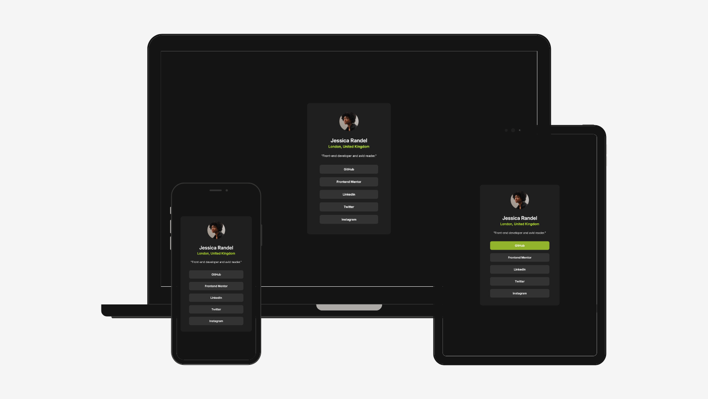

# Frontend Mentor - Social links profile solution

This is a solution to the [Social links profile challenge on Frontend Mentor](https://www.frontendmentor.io/challenges/social-links-profile-UG32l9m6dQ). The goal of this project was to build a simple and polished profile card displaying personal information and social links while focusing on layout, responsiveness, and accessibility.

## Table of contents

- [Overview](#overview)
  - [The challenge](#the-challenge)
  - [Screenshot](#screenshot)
  - [Links](#links)
- [My process](#my-process)
  - [Built with](#built-with)
  - [What I learned](#what-i-learned)
  - [Continued development](#continued-development)
  - [Useful resources](#useful-resources)
  - [AI Collaboration](#ai-collaboration)
- [Author](#author)
- [Acknowledgments](#acknowledgments)

## Overview

### The challenge

Users should be able to:

- View a profile card with a photo, name, location, and short biography
- See social link buttons that are clear and easy to interact with
- Navigate the page using the keyboard and understand which elements are interactive
- Enjoy a layout that remains visually balanced on different screen sizes

### Screenshot



### Links

- Solution URL: [Repository URL here](https://github.com/jucroizer/social_links_profile_project)
- Live Site URL: [Live site URL here](https://jucroizer.github.io/social_links_profile_project/)

## My process

### Built with

- Semantic HTML5 markup
- CSS custom properties
- Flexbox for layout and alignment
- Responsive CSS techniques such as percentage-based sizing and clamp()
- Accessibility-focused link labels and visible focus states

### What I learned

This project helped me practice the basics of building a small but complete interface from scratch. I learned how to structure content with semantic HTML, center and align elements with Flexbox, and make a card layout adapt smoothly to different screen widths. I also improved my understanding of accessibility by using meaningful link text and styling interactive elements for keyboard users.

Here is an example of the responsive styling approach used in this project:

```css
.card {
  width: min(90vw, 24rem);
  padding: clamp(1.25rem, 4vw, 2.5rem);
}
```

### Continued development

In future projects, I want to keep improving my skills in:

- responsive design
- accessibility best practices
- modern CSS layout techniques
- creating more polished and reusable UI components

### Useful resources

- [MDN Web Docs - HTML](https://developer.mozilla.org/en-US/docs/Web/HTML)
- [MDN Web Docs - CSS Flexbox](https://developer.mozilla.org/en-US/docs/Learn/CSS/CSS_layout/Flexbox)
- [Frontend Mentor community](https://www.frontendmentor.io/community)

### AI Collaboration

This project was supported with the help of GitHub Copilot during the development process. It was especially useful for:

- reviewing the HTML structure
- suggesting CSS improvements for responsiveness
- helping refine the accessibility approach
- drafting a complete README based on the provided template

### Author

- Name - RODRIGUEZ Justine
- Frontend Mentor - [@yourusername](https://www.frontendmentor.io/profile/jucroizer)
- GitHub - [@yourusername](https://github.com/jucroizer)

## Acknowledgments

Thanks to Frontend Mentor for the challenge inspiration and to the community for useful examples and feedback.